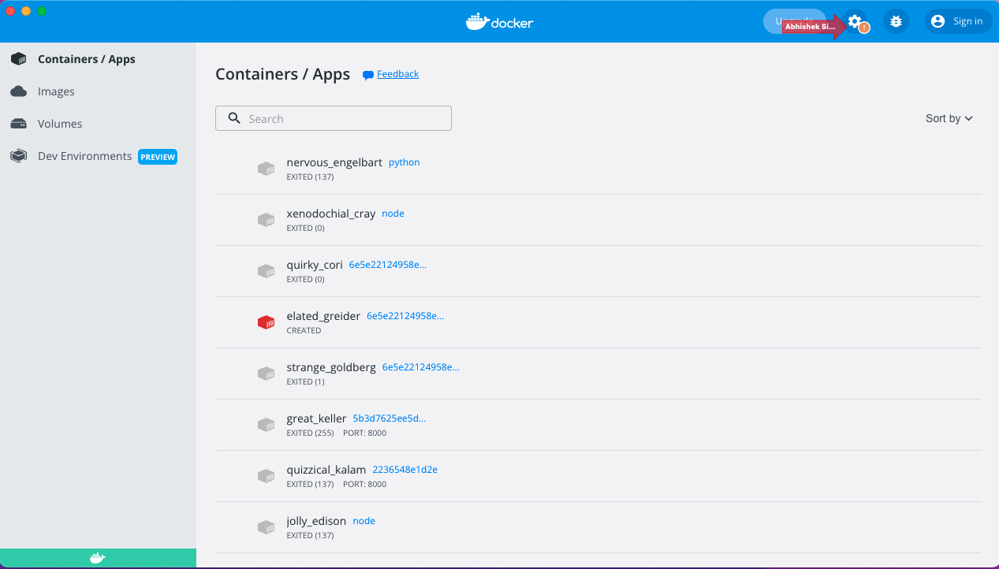
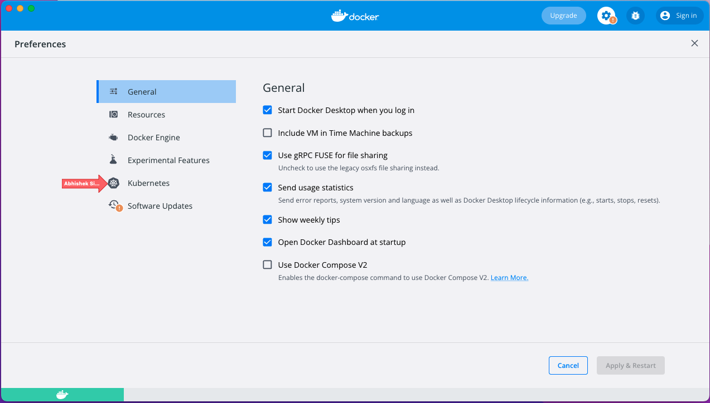
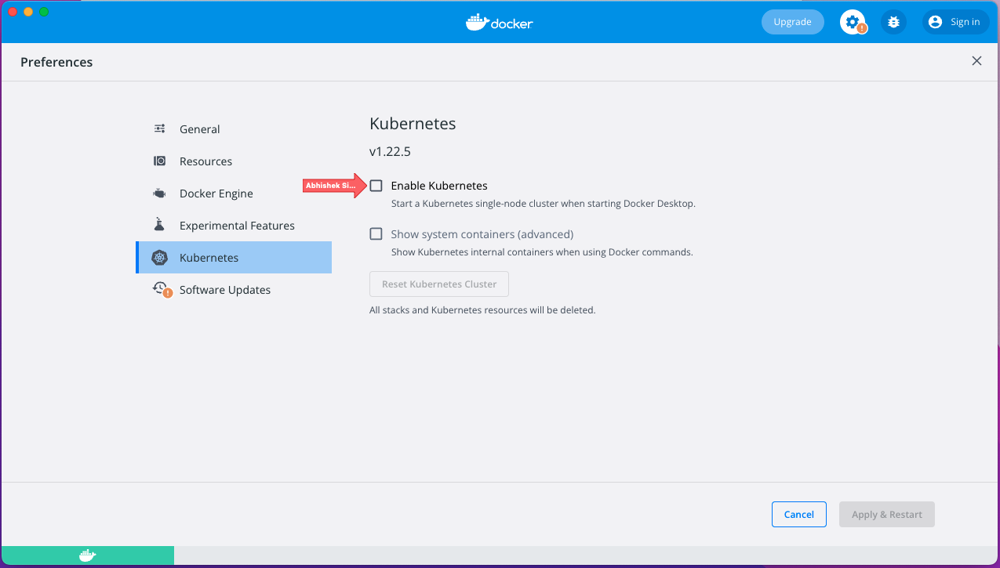
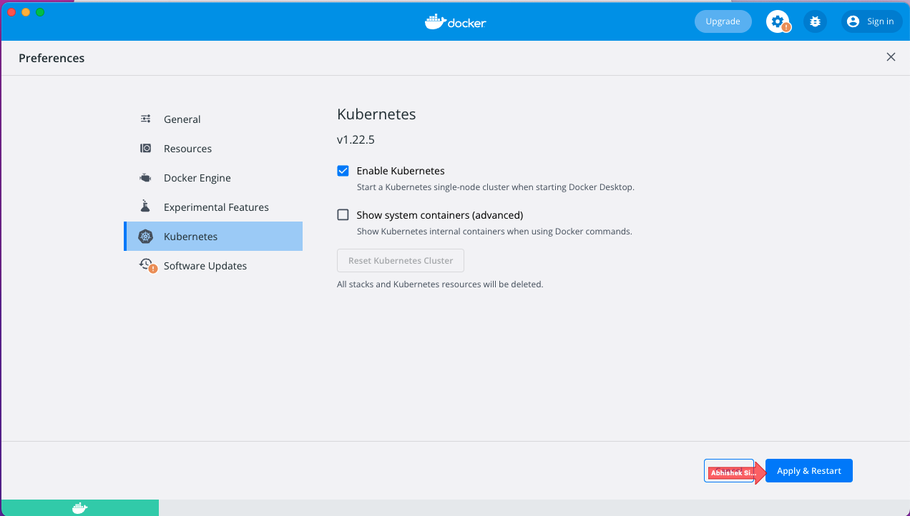

# nodejs-intro-to-devops

## Overview

This repository, is a nodejs introductory application to DevOps. It is a basic application that highlights the core principles of DevOps.

## Technologies
- Javascript (ES6+)
- Nodejs (v14.x)
- Express
- Jest
- Eslint
- Docker
- Kubernetes

## Setup & Prerequisites
### Install NodeJS
  First you will need to install NodeJS, if your unsure if you already have Node installed then run the version command (see below) to check for any currently installed versions of Node.
  
  ```
  node -v
  ```
  
  If this command gives and error or returns a version other than the one used for this exercise (v14.x) then you will need to install or update Node.

  If you are using a mac then the easiest way to install NodeJS is via brew, by using the following command:
  
  ```
  brew install node@14
  ```
  If you are using windows or linux then follow the installation instructions for your OS at https://nodejs.org/en/download/, you may need to navigate to the previous versions section and search for version 14.

  >If you wish to have multiple different versions of node installed at the same time, as different projects may have different requirements, then you can use a tool such as NVM (https://github.com/nvm-sh/nvm) to manage this. 

  ### Install Docker Desktop
  Next you will need to install Docker Desktop, to do this visit https://www.docker.com/products/docker-desktop/ and follow the instructions for your OS. 

  Once installed ensure docker desktop is running, on mac you should see the docker logo (whale with containers on its back) in your task bar on the top of your screen, when you hover your mouse over it, it should show you the status of docker, this should be `Docker Desktop is Running`.
  
  Open this and then click the cog icon in the top right to navigate to Preferences click on `Kubernetes` and then check the `Enable Kubernetes` box then hit `Apply & Restart`. 

  ### Install kubectl
  The final tool you need to install is kubectl the kubernetes command line tool. To do this visit https://kubernetes.io/docs/tasks/tools/ and follow the instructions for your OS.

  ### Install App Dependencies
  Finally before the app can be run we need to install its dependencies. To do this ensure that you are at the root of the repo and then run the following `npm` command.

  ```
  npm install
  ```

## Running the App locally
With all the prerequisite tools and app dependencies now installed you can run and interact with the app on your local machine. To do this run the following command from the root of the repo.


### Running the Tests
The App also contains a series of simple example unit tests, these can be run with the following command, this uses the Jest jaavscript testing framework (https://jestjs.io/).

```
npm run test
```

### Linting
Linting can also be ran against the app code by running the following command, this uses the Eslint javascript linting tool (https://eslint.org/).

```
npm run lint
```

### Node Application
```
npm run start
```

If successful you should see the following in your terminal

```
app listening on port 3000
```

With the app now running you are able to interact with it on the listening port listed in your terminal by making requests to it via a tool like Postman (https://www.postman.com/downloads/) on:

To test the application on your browser, click on the link below
http://localhost:3000

The app exposes 2 endpoints a `GET` on `/` and a `POST` on `/greet`. The first returns a simple Hello World message if successful, whilst the second expects a json body containing the name to greet, and will return a greeting if successful.

```
{
  "name": "Bob"
}
```
You can terminate the app at any time with `ctrl+c`.


With all dependencies installed you can now run your application using the code below. This will start the application without using docker. Once the application is up and running you can then call the endpoint using postman.


## Running the App in Docker
### Create a Dockerfile

| KEYWORD       | Usage Description
| ------------- | ------------- 
| FROM          | Defines the base image to use to start the build process. A image defined here will be pulled from Docker Hub or other container repository. It needs to be the first command declared inside a Dockerfile.         
| WORKDIR      | Set where the command defined with CMD is to be executed.       
| ENV          | Sets an Environment variable within the container & can be accessed by scripts and applications alike.         
| CMD          | Execute the given command when a container is instantiated using the image being built.         
| RUN          | Execute any additional command when docker image is built.        
| EXPOSE       | Used to associate a specified port to enable networking between the running process inside the container and the outside world (i.e. the host).
| COPY         | Takes in a src and destination arguments & copy a local file or directory from your host (the machine building the Docker image) into the Docker image itself.
| ADD          | Apart from what COPY does, it also supports 2 other sources. First, you can use a URL instead of a local file / directory. Secondly, you can extract a tar file from the source directly into the destination.        
| ENTRYPOINT   | Sets the concrete default application that is used every time a container is created using the image. For example, here we are using Spring Boot application inside the image. To only run that application use ENTRYPOINT and whenever a container is created our application will be the target. If we couple ENTRYPOINT with CMD, we can remove “application” from CMD and just leave “arguments” which will be passed to the ENTRYPOINT.


Once pieced together your base image definitions should looks something like the below:

```
FROM node:14-alpine3.16
```
```
WORKINGDIR /app
```
```
CPY . /app
```
```
RUN npminstall
```
```
RUN addgroup www; \
    adduser -D -G www nodeusr; \
    chown -R :www /app;
```
```
USER nodeusr
```
```
CMD ["npm", "start"]
```

Using the example above, create a docker file for this project [there are delebrate mistakes to be fixed].


### Build the Docker Image
Before we can run the docker image containing our app we first need to build it using the Dockerfile we previously created. We do this with the following command, specifying a tag to name the image (e.g. `my-node-app`) with the `-t` option, and then the path to the context (this is important as the src location in `COPY` commands is relative to this). Optionally you can also use the `-f` option followed by a path if your Dockerfile is in a different location from where you are building the image.

```
docker build -t <tag_name> <path_to_context>
```

If the image successfully builds then you should see it in the list of locally available images when you run the docker list images command:

```
docker image ls
```

### Running the Image
With the image now successfully built we can now run the image in a docker container, we can do this with the following run command, specifying the image name and tag, that we defined when we built it, with the `-p` option to expose ports and optionally the `-d` option to run it in detached mode in the background.

```
docker run -p <container_port>:<local_port> <image_name>
```

With the container now running you should be able to interact with the app as you did when you ran it locally substituting the port for the local port you defined when you ran the container. If you ran the container without the -d option then you should now see any output of the container in your terminal. If you ran the container in detached mode with the -d option then you can check to see if the container is running with the following command:

```
docker container ls
```

and you can check its output with the docker logs command using the `Container ID` found in the output of the previous command:

```
docker logs <container_id>
```

### Stopping the Container
If you ran the container in the foreground without the `-d` option then you can stop the container by using `ctrl+c`. However if you ran it in detached mode you can stop the container with the docker stop command using the `Container ID` found when you list the running containers.

```
docker stop <container_id>
```

### Setting up Kubernetes
Follow these steps below as shown in the images to setup Kubernetes as indicated by the red arrow

#### click on the gear icon

#### select kubernetes

#### Enable kubernetes checkbox

#### Click on Apply & Restart


### Running the App in Kubernetes

First we need to install kubernetes commandline tool using the code below:
```
brew install kubectl
```
To ensure your Kubernetes installation is working run the following command
```
kubectl get namespaces
```

You should see the image below:
These are the default namespaces that comes with your installation.


- There are two files we need to familiarise ourselves with, both of them are kubernetes manefest located in the kubernetes folder.

- These files outline the objects that will be created.

### Run the command in your terminal

Kubernetes apply will instruct the kubernetes api to create the object as specified in the kubernetes manifest.

```
kubectl apply -f ./kubernetes
```
The following command exposes the port
```
kubectl port-forward service/nodejs-intro-to-devops 3000:3000
```

The get pods lists all running pods. You should be able to see the nodejs intro to devops listed after this command is run.
```
kubectl get pods
```

Finally, to cleanup your project, run the command to delete the pod
```
kubectl delete -f ./kubernetes
```